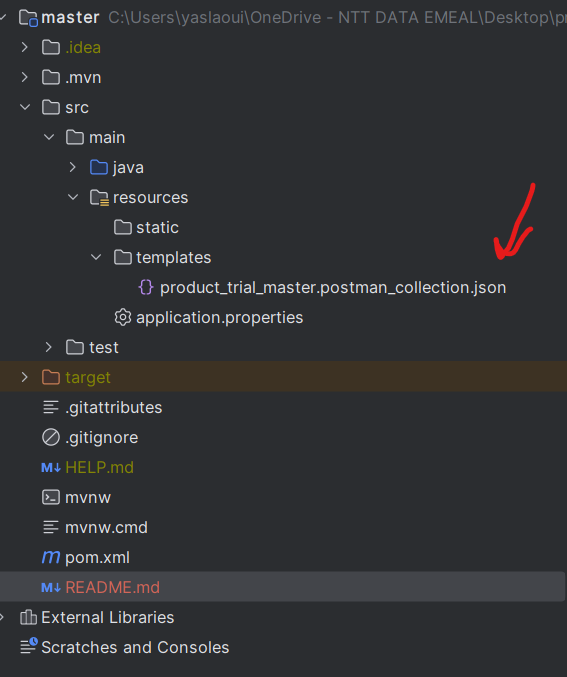

## Back-end
- Ce postman contient tous les api's crées
- 

Le back-end  gérer les API suivantes : 

| Resource       | POST                          | GET                                  | PATCH                                    | PUT | DELETE                             |
|----------------|-------------------------------|--------------------------------------|------------------------------------------|-----|------------------------------------|
| **/products**  | Create a new product          | Retrieve all products                | X                                        | X   | X                                  |
| **/products/:id** | X                             | Retrieve details for product 1       | Update details of product 1 if it exists | X   | Remove product 1                   |
| **/auth/token  | login using email et password | X                                    | X                                        | X   | X                                  |                  |
| **/auth/account | register new  user            | X                                    | X                                        | X   | X                                  |
| **/wishList    | Add product to wishlist       | retrieve all product from which list | X                                        | X   | Remove product from which list     |
| **/wishList/drop | X                             | X                                    | X                                        | X   | Remove all product from which list |
| **/panel       | Add n product to wishlist     | retrieve all product from which list | X                                        | X   | Remove n product from panel        |
| **/panel/drop  | X                             | X                                    | X                                        | X   | Remove All product from the panel  |

Un produit a les caractéristiques suivantes : 

``` typescript
class Product {
  id: number;
  code: string;
  name: string;
  description: string;
  image: string;
  category: string;
  price: number;
  quantity: number;
  internalReference: string;
  shellId: number;
  inventoryStatus: "INSTOCK" | "LOWSTOCK" | "OUTOFSTOCK";
  rating: number;
  createdAt: number;
  updatedAt: number;
}
```

Le back-end créé gérer tous  dans une base de données SQL avec le nom productTrialMaster.

### Partie 2

- Imposer à l'utilisateur de se connecter pour accéder à l'API.
  La connexion doit être gérée en utilisant un token JWT.  
  Deux routes devront être créées :
  * [POST] /account -> Permet de créer un nouveau compte pour un utilisateur avec les informations fournies par la requête.   
    Payload attendu : 
    ```
    {
      username: string,
      firstname: string,
      email: string,
      password: string
    }
    ```
  * [POST] /token -> Permet de se connecter à l'application.  
    Payload attendu :  
    ```
    {
      email: string,
      password: string
    }
    ```
    Une vérification devra être effectuée parmi tout les utilisateurs de l'application afin de connecter celui qui correspond aux infos fournies. Un token JWT sera renvoyé en retour de la reqûete.
- Faire en sorte que seul l'utilisateur ayant le mail "admin@admin.com" puisse ajouter, modifier ou supprimer des produits. Une solution simple et générique devra être utilisée. Il n'est pas nécessaire de mettre en place une gestion des accès basée sur les rôles.
